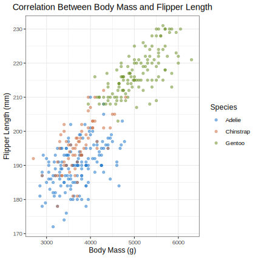
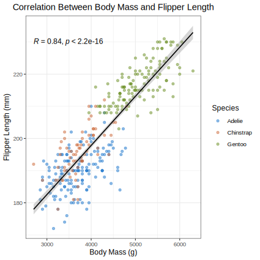
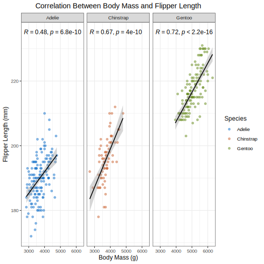

# Introduction
For my analysis, I have decided to look at the relationship between body mass and flipper length for the Palmer Penguins dataset. I then decided to look at how this relationship varies by species. Thus, I first looked at whether there is an overall correlation between flipper length and body mass, and then separated the data to see if there is any difference between the correlation for each of the three species (Adelie, Chinstrap and Gentoo).
 
### Set up the document

#### Load packages
To begin with, the necessary packages need to be installed and loaded into the script. 
```{r, eval=FALSE, include = FALSE}
#Install necessary packages
#This line needs to be run if any packages are not installed
install.packages(c("ggplot2", "palmerpenguins", "janitor", "dplyr", "ragg", "svglite", "ggpubr", "cocor"))
```
```{r, message = FALSE}
library(ggplot2)
library(palmerpenguins)
library(janitor)
library(dplyr)
library(ragg)
library(svglite)
library(ggpubr)
library(cocor)
```

##### Reading and cleaning the data

First, the data needs to be read into the R markdown document and then cleaned to make the column names useable for analysis. This can be achieved using the cleaning functions stored in the 'cleaning.R' script. 

```{r}
#Set up the source location for function codes
source("functions/cleaning.R") #Cleaning functions
source("functions/plotting.R") #Plotting functions
``` 

```{r}
#Read in the data
#First save the penguins data as a csv file. 
write.csv(penguins_raw, "data/penguins_raw.csv") #Save this in a folder called 'data' within the project
penguins_raw <- read.csv("data/penguins_raw.csv") #Read in the created csv file. 

#Clean the data
penguins_clean_data <- clean_data(penguins_raw) 
write.csv(penguins_clean_data, "data/penguins_clean_data.csv") #Save as a csv
penguins_clean <- read.csv("data/penguins_clean_data.csv") #Read in the created csv file. 
```

##### Subset the data
To begin my analysis and look at the relationship between flipper length and body mass, I first need to subset the data to isolate the columns needed for my analysis. I am looking at the relationship between flipper length and body mass, and I also want to look at how this relationship varies by species.  

```{r}
#Subset the data
flipper_mass_data <- subset_columns(penguins_clean, c('species', 'flipper_length_mm', 'body_mass_g')) #Subset the data 'penguins_clean' to only focus on the columns used for my analysis (species, flipper length, and body mass)
```

## Hypothesis

For my analysis, I will be testing two hypotheses:

**Hypothesis 1:**\
Is there an overall positive correlation between flipper length and body mass?\

- Null hypothesis: The overall correlation coefficient is equal to (=) 0\
- Alternative hypothesis: The overall correlation coefficient is not equal to ($\not=$) 0\
    
    
**Hypothesis 2:**\
Is there a difference in the correlation coefficients between species?\

- Null hypothesis: There is no difference in the correlation coefficients between species (r1 = r2 = r3).\
- Alternative hypothesis: There is a significant difference in the correlation coefficients between at least two species (r1 $\not=$ r2). 

First, I have created an exploratory figure to look at the relationship between flipper length and body mass which is colour coded by species. 

```{r, warning = FALSE, message = FALSE, echo = FALSE}
#I have plotted this figure using the plotting and save figures functions in the 'plotting/R' script. 
#The plot is then saved in the 'figures' folder within the R project
#I have then added this plot to the markdown using:  code which creates a path to add the plot to the document
#I have also added a figure legend to the graph

exploratory_figure <- save_exploratory_svg(flipper_mass_data, "figures/exploratory_figure.svg", size = 15, scaling = 1.1)
```


From the exploratory figure, there appears to be a positive correlation between body mass and flipper length. However, this needs to be formally tested. 

## Methods
### 1. Calculating the overall correlation coefficient

#### Test of normality
In order to calculate the correlation coefficient, it is important to test the data for normality. This can be done using the Shapiro Wilks test. 
```{r}
shapiro.test(flipper_mass_data$body_mass_g) #Test of normality for body mass
shapiro.test(flipper_mass_data$flipper_length_mm) #Test of normality for flipper length
```
The Shapiro Wilks test tests the null hypothesis that the data is normally distributed. Since P<0.05 for both flipper length and body mass, the null hypothesis is rejected, meaning the data is not normally distributed. 

Therefore, to calculate the overall correlation coefficient, I need to use Spearman's Rank Correlation test since this is a non-parametric test. This tests my first hypothesis: Is there an overall positive correlation between flipper length and body mass?

```{r, warning = FALSE}
cor.test(flipper_mass_data$body_mass_g, flipper_mass_data$flipper_length_mm, method = "spearman") #Spearman's Rank correlation test
```

The resulting correlation coefficent for the overall data is 0.840, with a p-value of 2.2e-16. Therefore, the null hypothesis for my first hypothesis can be rejected. This suggests that overall there is a significant positive correlation between body mass and flipper length.

### 2. Calculating the correlation coefficient for each species

I then decided to calculate the correlation coefficient for each species individually. This is to test my second hypothesis: Is there a difference in the correlation coefficients between species?

##### Subset the data
First, the data needs to be subsetted for each species.
```{r}
adelie <- filter_by_species(flipper_mass_data, "Adelie") #Subset the data for Adelie
chinstrap <- filter_by_species(flipper_mass_data, "Chinstrap") #Subset the data for Chinstrap
gentoo <- filter_by_species(flipper_mass_data, "Gentoo") #Subset the data fo Gentoo
```

##### Spearman's Rank Correlation test
Then, a Spearman's Rank Correlation test can be carried out for each species.
```{r, warning = FALSE}
cor.test(adelie$body_mass_g, adelie$flipper_length_mm, method = "spearman") #For Adelie
cor.test(chinstrap$body_mass_g, chinstrap$flipper_length_mm, method = "spearman") #For Chinstrap
cor.test(gentoo$body_mass_g, gentoo$flipper_length_mm, method = "spearman") #For Gentoo
```

### 3. Comparing species correlation coefficients 
In order to determine if there is a significant difference between the correlation coefficients for each of the species, I need to carry out a further test. One way this can be achieved is by using the 'cocor' package. This is a package that has been developed specifically for comparing correlations. Independent groups can be compared using this package. The package uses the Fisher's r-to-Z transformation to then calculate a confidence interval. This is to test the null hypothesis that the two correlation coefficients are equal (i.e. r1 = r2). Thus, with this package, the difference between the correlation coefficients for each of the three penguin species can be tested.  
```{r}
#Comparison of two correlation coefficients.
#Format uses the two correlation coefficients and the sample size for each species
cocor.indep.groups(0.475, 0.670,152, 68) #Comparison of Adelie and Chinstrap
cocor.indep.groups(0.475, 0.717, 152,124) #Comparision of Adelie and Gentoo
cocor.indep.groups(0.670, 0.717, 68,124) #Comparison of Chinstrap and Gentoo
```


## Results

### Results of Spearman's Rank Correlation Tests

|Test      |Correlation Coefficient|P-Value    |Significance    |
|:--------:|:---------------------:|:---------:|:--------------:|
|Overall   |0.840                  |2.2e-16    |P<0.05          |
|Adelie    |0.475                  |6.846e-10  |P<0.05          |
|Chinstrap |0.670                  |3.983e-10  |P<0.05          |
|Gentoo    |0.717                  |2.2e-16    |P<0.05          |

### Overall Results


```{r, include = FALSE, warning = FALSE, message = FALSE}
#Plot and save the overall figure. 
#This has been created and added in the same way as the exploratory figure

overall_figure <- save_overall_svg(flipper_mass_data, "figures/overall_figure.svg", size = 15, scaling = 1.1)
```


### Individual Species Results
```{r, include = FALSE, warning = FALSE, message = FALSE}
#Plotted in the same way as the previous figures
species_figure <- save_species_svg(flipper_mass_data, "figures/species_figure.svg", size = 18.5, scaling = 1.1)
```


### Is there a significant difference in the correlation coefficients for the different species?
The second hypothesis that I tested was: Is there a difference in the correlation coefficients between species?

I tested this hypothesis using the cocor package which tests the null hypothesis that the two correlation coefficients are equal (i.e. r1 = r2). Thus, rejecting the null hypothesis suggests that there is a significant difference between the two correlation coefficients. 

Below are the results of the tests: 

|Comparison          |Confidence Interval|P-value|Is the null hypothesis rejected?|
|:------------------:|:-----------------:|:-----:|:------------------------------:|
|Adelie and Chinstrap|-0.3700, -0.0011    |0.0478 |Reject                         |
|Adelie and Gentoo   | -0.3955, -0.0912  |0.0017 |Reject                          |
|Chinstrap and Gentoo|-0.2209, 0.1028    |0.5553 |Fail to Reject                  |

Thus, the null hypothesis for my second hypothesis can be rejected, as there is a significant difference in the correlation coefficients for at least one of the pairs of species. 

## Discusssion
From the results, there is a significant correlation between flipper length and body mass for all three species of penguins. This can be seen both when looking at the overall correlation (Fig. 2) and also when looking at each of the three species individually (Fig.3). For each of the Spearman's Rank Correlation tests, p<0.05 suggesting a significant positive correlation.

However, when comparing the correlation coefficients for each of the three species, there appears to be a signficant difference between the correlation coefficients for Adelie and Chinstrap, and Adelie and Gentoo, but not for Chinstrap and Gentoo. This highlights that even though there is a significant positive correlation coefficient for each of the three species, the strength of the relationship can vary. However, further analysis would be needed to test why Adelie has a significantly different correlation coefficient compared to the other two species.

It is also important to note that correlation does not equal causation. Despite there being a significant positive correlation, an increase in body mass does not directly cause an increase in flipper length. This result may in fact be due to taller individuals generally having a larger flipper size, and also having a higher body mass. Thus, it is important to be clear that a higher body mass does not cause a longer flipper length. Perhaps a larger flipper may be more indicative of a higher body mass since a larger flipper would suggest a taller and thus larger individual. However, the causative nature of this relationship is not clear through my analysis and would require further tests.

## Conclusion
My results showed that there is a positive correlation between body mass and flipper length, both when looking at the overall trend and each of the three species individually. Furthermore, I also showed that Adelie has a significantly different correlation coefficient than the other two species.  However, since only correlation has been tested, the causative nature of this relationship is not clear, and would require further analysis. This would preferably be achieved using a larger sample size and a larger range of penguin species. A larger sample size would be more representative of the population mean. Furthermore, this would also allow to test if this trend can be seen in more penguin species than the three tested here.


